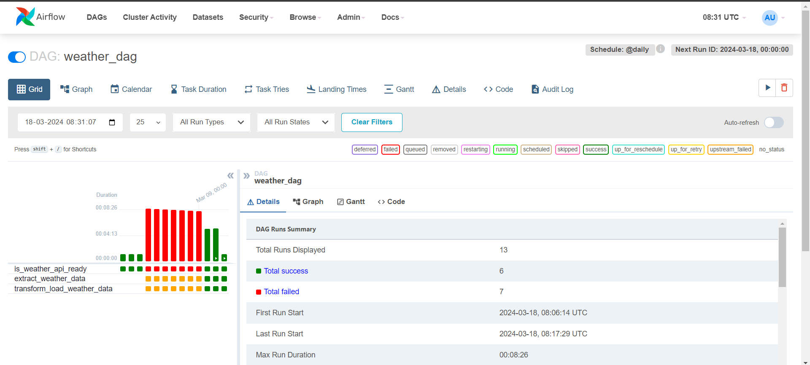

# OpenWeather Data Engineering Project README

## Overview

This project is a data engineering pipeline implemented using Apache Airflow on Amazon Web Services (AWS) for processing OpenWeather data. The pipeline involves extracting weather data from the OpenWeather API, transforming it, and loading it into a data warehouse for analysis and visualization.

## Components

### 1. Data Source

- **OpenWeather API**: Data is extracted from the OpenWeather API, which provides current weather data, forecasts, and historical weather data.

### 2. AWS Services

- **Amazon S3 (Simple Storage Service)**: Used for storing intermediate data files and any necessary configuration files.

- **Apache Airflow**: Used for orchestrating the data pipeline.
  - **DAGs (Directed Acyclic Graphs)**: Define the workflow of the pipeline.
  - **Operators**: Perform tasks such as data extraction, transformation, and loading.
  - **Schedulers**: Schedule and monitor the execution of tasks.

### 3. Data Pipeline Steps

1. **Extract Data**: Use Airflow to call the OpenWeather API and retrieve weather data for specified locations and time periods.

2. **Transform Data**: Cleanse and transform the raw weather data into a structured format suitable for analysis.

3. **Load Data into S3**: Load the transformed weather data into S3 for storage and analysis.

## Setup Instructions

1. **AWS Setup**:
   - Set up an AWS account if you haven't already.
   - Create an S3 bucket for storing intermediate data files.

2. **OpenWeather API Setup**:
   - Sign up for an OpenWeather API account and obtain an API key.

3. **Apache Airflow Setup**:
   - Deploy an Airflow environment on AWS using services like Amazon ECS, EC2, or EMR.
   - Define the DAGs, operators, and connections in Airflow for orchestrating the pipeline.

4. **Configuration**:
   - Configure Airflow to use the OpenWeather API key.
   - Set up connections to Amazon S3 in Airflow.

5. **Run the Pipeline**:
   - Trigger the DAGs in Airflow to start the data pipeline execution.

## Notes

- Monitor AWS costs, especially related to data storage usage.
- Consider setting up monitoring and alerting for the pipeline to detect and handle failures.
- Ensure proper error handling and logging in the Airflow DAGs for troubleshooting.

## Contributors

- Ritesh Ojha

## Contact

For questions or feedback, please contact riteshojha2002@gmail.com.
