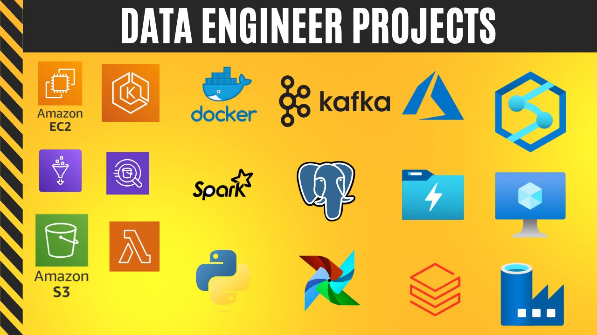

# Data Engineering End to End Projects

This repository contains all my data engineering projects. In this repo, I will be exploring various data engineering tools and techniques.

## Projects

1. [OpenWeather](/OpenWeather/)
   - A data pipeline implemented using Apache Airflow on Amazon Web Services (AWS) for processing OpenWeather data. 
   - The pipeline involves extracting weather data from the OpenWeather API, transforming it, and loading it into a data warehouse for analysis and visualization.

2. [Podcast](/Podcast/)
   - I created a data pipeline using Airflow on docker. The pipeline will download podcast episodes. 
   - I stored our results in a Postgres database that we can easily query.

3. [Spotify](/Spotify/)
   - A data  pipeline implemented on Amazon Web Services (AWS) for processing Spotify data. 
   - The pipeline involves loading CSV files containing information about artists, tracks, and albums into an S3 bucket.
   - performing ETL (Extract, Transform, Load) using AWS Glue, storing the processed data as Parquet files, and finally querying and visualizing the data using Amazon Athena and Power BI.

4. [Smart City](/Smart-City/)
   - A data engineering project for simulating data generation using Python for Apache Kafka, processing the data with Apache Spark, and storing it in Amazon S3. 
   - All services will be orchestrated and run on Docker containers.

